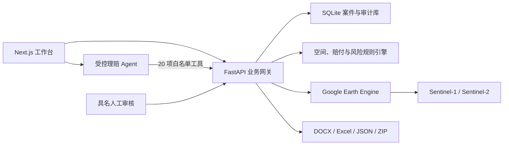

# Agrisky AI | 穹野智保

[中文](#中文) | [English](#english)

## 中文

Agrisky AI（穹野智保）是一个开源的农业保险查勘、定损与理赔协同 Agent 工作台。它将保单与案件数据、Google Earth Engine 遥感计算、作物长势分析、空间合规校验、赔付规则和报告生成连接为可执行、可解释、可审计的受控工作流。

> Agrisky AI 提供辅助分析与理赔建议，不替代保险机构、查勘人员或审核人员作出最终决定。

### 产品演示

[观看或下载 Agrisky AI 完整演示视频](https://github.com/XvHaoR/Agrisky-AI-Shanghai-2026/releases/tag/v1.0.0-shanghai)

### 核心优势

- **可执行 Agent**：模型通过 20 项白名单工具读取案件、核验材料、调度遥感分析、读取保单合同、测算赔付并生成报告草稿。
- **合同规则闭环**：保单版本可绑定并冻结带 SHA-256 摘要的保险合同；合同条款、受灾面积、减产率与生育期系数共同驱动赔款测算，并被报告和审计链路逐项引用。
- **确定性业务内核**：面积、减产率、赔付金额和风险等级由服务端空间引擎与规则引擎计算，模型负责理解意图和编排工具，不直接改写关键数值。
- **遥感证据链**：整合 Sentinel-1 SAR、Sentinel-2 NDVI 及多源植被指标，支持当前长势、历史季度趋势和分地块分析。
- **人工审核门禁**：Agent 最多推进到 `REPORT_DRAFTED`，具名管理员审核后才能进入 `ARCHIVED`。
- **可追溯结果**：持久化 Agent Run、工具事件、案件状态迁移、报告生成批次和 SHA-256 摘要。
- **数据最小暴露**：模型仅接收业务摘要和指标，原始地块坐标、上传文件及身份敏感字段留在服务端。

### Agent 能力

| 能力 | 说明 |
| --- | --- |
| 队列分析 | 汇总案件状态、边界就绪情况、风险、预估赔付和调度优先级 |
| 案件创建 | 从在册保单建立案件并继承作物和地块边界 |
| 材料理解 | 比较材料提取字段与保单、案件字段，返回冲突、置信度和来源引用 |
| 自动调度 | 按状态机执行材料校验、卫星初筛、长势、减产、合规、赔付、评级和报告生成 |
| 遥感分析 | 执行 SAR 初筛、当前 NDVI、历史 NDVI、多源减产率和分地块长势分析 |
| 风险与赔付 | 使用版本化 YAML 规则计算合规面积、赔付建议和风险等级 |
| 合同规则核验 | 读取已冻结合同、核对责任范围与保险期间，并在赔款和报告中引用合同条款 |
| 结果交付 | 生成 DOCX、Excel、JSON、图表和带完整性清单的报告包 |
| 审计追踪 | 记录 Agent Run、工具调用、人工审核、状态迁移及产物哈希 |

### 技术架构



### 受控工作流

```text
INIT -> MATERIAL_CHECK -> PREPROCESS_READY -> SCREENING_DONE
     -> LOSS_ASSESSED -> COMPLIANCE_DONE -> RULE_DONE
     -> REPORT_DRAFTED -> HUMAN_REVIEW -> ARCHIVED
```

Agent 可以自动推进到 `REPORT_DRAFTED`。归档动作不在 Agent 工具白名单中，只能由具名管理员会话执行。

### 技术栈

- Agent：OpenAI-compatible tool calling、结构化工具参数、持久化 Run/Event
- 后端：Python 3.11+、FastAPI、Pydantic、SQLite
- 遥感与空间分析：Google Earth Engine、GeoPandas、Rasterio、Shapely、PyProj
- 前端：Next.js 15、React 18、TypeScript、React Markdown、Lucide
- 交付与质量：Docker Compose、Pytest、ESLint、GitHub Actions

### 快速开始

#### Docker Compose

```bash
cp .env.example .env
docker compose up --build
```

默认地址：

- Web：`http://localhost:3000`
- API：`http://localhost:8000`
- 健康检查：`http://localhost:8000/health`

首次启动前，至少设置：

```env
AGRISKY_BOOTSTRAP_ADMIN_USERNAME=your-admin
AGRISKY_BOOTSTRAP_ADMIN_PASSWORD=use-a-unique-password-of-at-least-12-characters
AGENT_API_KEY=your-openai-compatible-api-key
GEE_PROJECT_ID=your-earth-engine-project-id
GEE_CREDENTIALS=/absolute/path/to/service-account.json
```

生产环境建议通过容器 Secret、云端密钥管理服务或受控环境变量注入凭据，并为管理员账号设置独立的高强度密码。

#### Windows 开发环境

```powershell
powershell -ExecutionPolicy Bypass -File scripts\setup_windows.ps1
powershell -ExecutionPolicy Bypass -File scripts\dev_windows.ps1
```

#### 手动启动

```bash
python -m pip install -r requirements.txt -r requirements-dev.txt
python -m uvicorn main:app --app-dir api_gateway --host 127.0.0.1 --port 8000

cd frontend-next
npm ci
npm run dev -- --hostname 127.0.0.1 --port 3000
```

### Google Earth Engine

生产遥感分析需要有效的 Earth Engine 项目和服务账号凭证。通过 `GEE_CREDENTIALS` 或 `GOOGLE_APPLICATION_CREDENTIALS` 指定凭据路径，容器部署时建议以只读方式挂载并限制文件访问权限。生产模式下远程遥感失败会明确报错，不会伪装成模拟结果。

### 测试

```bash
python -m pytest

cd frontend-next
npm ci
npm run check
npm run build
```

公开数据复验使用 Sen1Floods11 官方划分，固定 100 个训练、20 个校准和 30 个独立测试样本。SAR 特征融合 v2 在独立测试样本上取得微观 F1 79.6%、IoU 66.1%，水体面积比例中位绝对误差 2.09 个百分点。该结果验证灾后水体/非水体分割，不代表新增淹没范围、作物损失或最终赔款准确性。

```bash
python -m pip install -r validation/requirements.txt
python -m validation.sen1floods11_benchmark all
```

逐样本结果、指标图和验证报告位于 `validation/`。

### 运行数据与安全

案件、审计记录和 Agent Run 默认写入 `AGRISKY_DB_PATH` 指定的 SQLite 数据库，分析产物写入 `AGRISKY_OUTPUT_ROOT`。生产部署应为这两个路径配置持久化存储和定期备份，并对凭据、用户材料及报告目录实施最小权限访问控制。

### 许可证

本项目采用 [Apache License 2.0](LICENSE)。第三方数据、卫星影像和外部服务仍受各自条款约束。

---

## English

Agrisky AI is an open-source, auditable agent workspace for agricultural insurance inspection, loss assessment, and claims coordination. It connects policy and claim data, Google Earth Engine remote-sensing analysis, crop-growth analytics, spatial compliance checks, payout rules, and report generation through an executable, explainable, and controlled workflow.

> Agrisky AI provides decision support. It does not replace the final judgment of insurers, field adjusters, or authorized reviewers.

### Product demo

[Watch or download the full Agrisky AI demo](https://github.com/XvHaoR/Agrisky-AI-Shanghai-2026/releases/tag/v1.0.0-shanghai)

### Key advantages

- **Executable agent**: the model uses 20 allowlisted tools to inspect cases, validate materials, orchestrate remote-sensing jobs, inspect policy contracts, estimate payouts, and produce report drafts.
- **Contract-backed claims rules**: a policy version can bind and freeze an insurance contract with a SHA-256 digest. Its terms, validated affected area, loss ratio, and growth-stage coefficient jointly drive payout estimation and are cited in reports and audit records.
- **Deterministic business core**: area, yield loss, payout, and risk values are computed by server-side spatial and rules engines. The model interprets intent and orchestrates tools but does not invent authoritative numbers.
- **Remote-sensing evidence chain**: Sentinel-1 SAR, Sentinel-2 NDVI, and multiple vegetation indicators support current growth, historical seasonal trends, and parcel-level analysis.
- **Human-review gate**: the agent stops at `REPORT_DRAFTED`; only an identified administrator can approve a case into `ARCHIVED`.
- **Traceable outputs**: Agent Runs, tool events, state transitions, report generations, and SHA-256 digests are persisted.
- **Minimal data exposure**: the model receives business summaries and derived indicators while raw parcel coordinates, uploaded files, and sensitive identity fields remain server-side.

### Agent capabilities

| Capability | Description |
| --- | --- |
| Queue analysis | Summarizes workflow states, boundary readiness, risk, estimated payouts, and dispatch priority |
| Claim creation | Creates a claim from a registered policy and inherits crop and parcel boundaries |
| Material understanding | Compares extracted fields with policy and claim records, returning conflicts, confidence, and source references |
| Workflow orchestration | Runs validation, satellite screening, growth, loss, compliance, payout, rating, and report tasks through the state machine |
| Remote-sensing analysis | Runs SAR screening, current NDVI, historical NDVI, multi-source loss assessment, and parcel growth analysis |
| Risk and payout | Uses versioned YAML rules for compliant area, payout recommendations, and risk classification |
| Contract rule check | Reads the frozen policy contract, checks coverage and period eligibility, and cites contract clauses in payout and report outputs |
| Deliverables | Produces DOCX, Excel, JSON, charts, and report packages with integrity manifests |
| Audit trail | Records Agent Runs, tool calls, human reviews, state transitions, and artifact hashes |

### Architecture

The system consists of a Next.js operations console, a FastAPI business gateway, an OpenAI-compatible tool-calling agent, deterministic spatial and financial engines, a SQLite audit store, and Google Earth Engine integrations for Sentinel-1 and Sentinel-2 analysis.

The controlled state machine is:

```text
INIT -> MATERIAL_CHECK -> PREPROCESS_READY -> SCREENING_DONE
     -> LOSS_ASSESSED -> COMPLIANCE_DONE -> RULE_DONE
     -> REPORT_DRAFTED -> HUMAN_REVIEW -> ARCHIVED
```

The agent can advance a case only to `REPORT_DRAFTED`. Archiving is intentionally absent from the agent tool registry and requires an identified administrator session.

### Stack

- Agent: OpenAI-compatible tool calling, structured arguments, persistent Run/Event records
- Backend: Python 3.11+, FastAPI, Pydantic, SQLite
- Geospatial: Google Earth Engine, GeoPandas, Rasterio, Shapely, PyProj
- Frontend: Next.js 15, React 18, TypeScript, React Markdown, Lucide
- Delivery: Docker Compose, Pytest, ESLint, GitHub Actions

### Quick start

```bash
cp .env.example .env
docker compose up --build
```

Default endpoints:

- Web: `http://localhost:3000`
- API: `http://localhost:8000`
- Health: `http://localhost:8000/health`

Before the first production-like start, configure a unique bootstrap administrator, an OpenAI-compatible model API key, and valid Google Earth Engine credentials. For production, inject credentials through container secrets, a managed secret store, or protected environment variables.

### Validation

```bash
python -m pytest

cd frontend-next
npm ci
npm run check
npm run build
```

The public-data benchmark preserves the official Sen1Floods11 splits with 100 training, 20 calibration, and 30 held-out test chips. On the held-out chips, SAR feature fusion v2 reaches 79.6% micro F1, 66.1% micro IoU, and a 2.09 percentage-point median absolute water-area error. This evaluates post-event water/non-water segmentation, not newly flooded water, crop loss, or final indemnity accuracy.

```bash
python -m pip install -r validation/requirements.txt
python -m validation.sen1floods11_benchmark all
```

Per-sample outputs, figures, and the validation report are under `validation/`.

### Runtime data and security

Claims, audit records, and Agent Runs are stored in the SQLite database configured by `AGRISKY_DB_PATH`; generated artifacts are written under `AGRISKY_OUTPUT_ROOT`. Production deployments should use persistent storage and scheduled backups for both paths, with least-privilege access controls for credentials, user materials, and reports.

### License

Licensed under the [Apache License 2.0](LICENSE). Third-party datasets, satellite imagery, and external services remain subject to their own terms.
